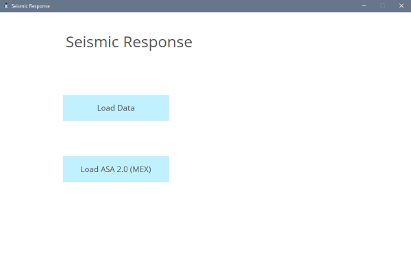
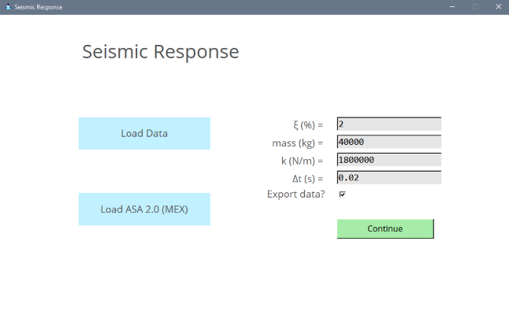
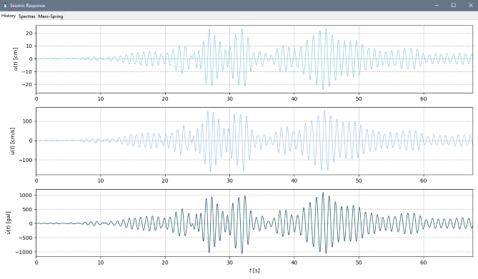
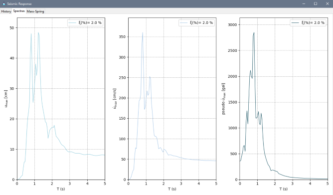
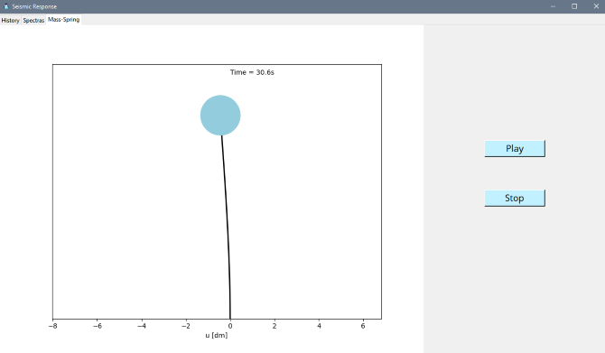
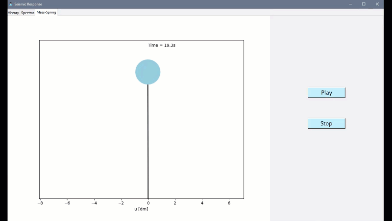
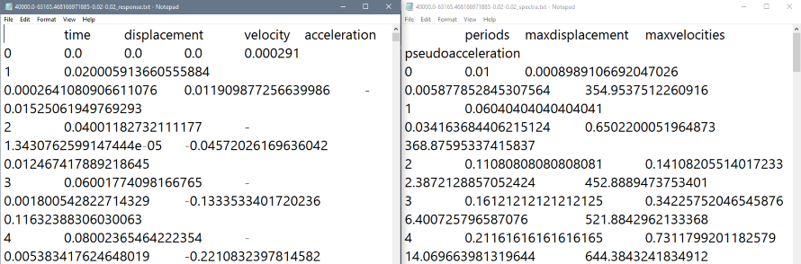

# Seismic Response

This tool will make practical the analysis of an acceleration registry file by just picking a file and input the structure's properties. The program will compute the displacements, velocities and acceleration, response and spectra from a list of accelerations. The numerical method for the general dynamic load is the _interpolation method_.

You only need a file with a list of acceleration [$cm/s^2$] and choose `Load Data`. Thereafter you will be required to enter the mass `m` [$kg$], stiffness `k` [$N/m$], damping ratio $\xi$ [\%], and the time step $\Delta t$ [$s$] between each element of your list, also you can choose to export the data to a .txt file, so you have the numerical values.

---
## Standard Acceleration File (ASA 2.0)

This type of file (ASA 2.0) has a standard template and is widely used in Mexico. To load such file use `Load ASA 2.0`.

> The time step computed cannot be changed, if you want to use a different one, then the first option has to be used.

> You only need to make sure the file extension is a .txt and the program will load it
---

`class Seismic`

* `interpol_meth(...)`: is the general dynamic load solver through the interpolation method

    **Parameters:** 
    
    * **_seismic_data_:** _(dict)_ the oscillator characteristics.
      * **_mass_**  in kilograms $kg$
      * **_stiffness_** in $N/m$
      * **_xi_** damping ratio in %
      * **_forces_** (_list_) contains the accelerations recorded of the earthquake
      * **_Dt_** time step between the elements of 

    **Returns: _list_** 
    
    * **u:**  _(list)_ displacements computed.
    * **u_:**  _(list)_ velocities computed.
    * **u__:**  _(list)_ pseudoaccelerations of the oscillator computed.
    * **t:**  _(list)_ time of the response. It has the same number of elements as _u___

* `seismic_spectra(...)` this function is used to get the response spectra of an oscillator with the accelerations registry.

    **Parameters:** 
    
    * **_seismic_data_:** _(dict)_ the same data as in `interpol_meth(...)`

    * **_spectras_config_:** _(dict)_ spectras characteristics
      * **_t_max_**  the maximum period to be computed.
      * **_spctrum_pts_** the number of points to compute or the number of iterations to do. The greater the number, the more time it will take to compute.

    **Returns: _dict_** 
    
    * **periods:**  _(list)_ periods.
    * **u_max:**  _(list)_ maximum displacement of each period.
    * **v_max:**  _(list)_ maximum velocity of each period.
    * **a_max:**  _(list)_ maximum acceleration of each period.

* `seismic_spectra_fig(self, spectra_data, plot_config)` creates the plot to be used in the GUI.

    **Parameters:** 
    
    * **_spectra_data_:** _(dict)_ the data returned by `seismic_spectra(...)`  
      * **periods:**  _(list)_ periods.
      * **u_max:**  _(list)_ maximum displacement of each period.
      * **v_max:**  _(list)_ maximum velocity of each period.
      * **a_max:**  _(list)_ maximum acceleration of each period.

    * **_plot_config_:** _(dict)_ plot style settings.
      * **_gridstyle_**  grid style. Checkout the matplotlib gridstyles.
      * **_lw_** linewidth.
      * **_hstry_a_** color of the acceleration data.
      * **_hstry_d_** color of the displacement data.
      * **_hstry_v_** color of the velocity data.

    **Returns: _matplotlib.figure_**

* `response_fig(...)`

    **Parameters:** 
    
    * **_seismic_data_:** _(dict)_ same data as in `interpol_meth(...)`

    * **_plot_config_:** _(dict)_ same data as in `seismic_spectra_fig(...)`

    **Returns: _matplotlib.figure_**

---
## Settings
### `config.ini`

* [START]: you can set the standard default values mass, stiffness and damping ratio that the program will load when reading a file.
* [SAFFILE]: for the standard acceleration files (ASA 2.0), you can indicate the row of the file where the duration, maximum acceleration, and the acceleration list starting position are. The defaults are based on the ASA 2.0 conventions. It is recommended to not change this settings. Modify at your own risk.
* [PLOTS]: you can modify the plot colors, linewidth and gridstyle on this section.
* [SPECTRA]: in this section you can change the range of the spectras on _t_max_ [$s$] and the amount of data points to compute on _spctrum_pts_ (warning: a big number will take longer to compute)
* [ANIMATION]: here the mass dot size of the animation can be changed and so its color.
---
## Example

> Run `main.py`

Load the `IN187903_355.txt`. And write your model's properties. For this example is $\xi=2\%$, $k=1,800,000 \; N/cm$, $m=40,000\; kg$, the calculated time step $\Delta t=0.02 s$ and _Export data_ marked.

The results are the following.

---
_“Los registros acelerográficos proporcionados han sido producto de las labores de instrumentación y procesamiento de la Unidad de Instrumentación Sísmica del Instituto de Ingeniería de la UNAM”._